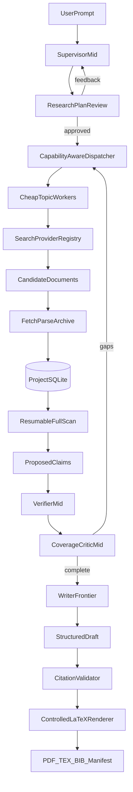
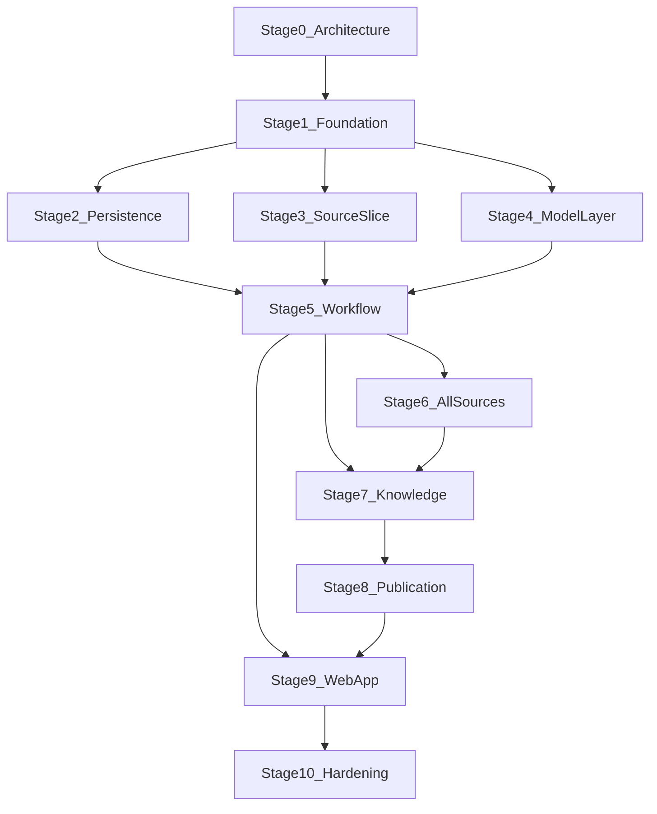

# DeepRhetor — Product and Architecture Plan

> This is the source of truth for product intent, architecture, model behavior,
> persistence, tools, and build stages. Decisions recorded here should not need
> to be rediscovered from chat history.
>
> Stage 0 is the design captured in this file. Stages 1–2 (foundation and
> persistence/recovery) are complete.

## Vision

DeepRhetor is a local research-and-writing application. Given a descriptive
prompt, it:

1. turns the prompt into an approval-ready research plan;
2. decomposes that plan into narrow topics and research angles;
3. assigns those angles to inexpensive workers and appropriate source plugins;
4. discovers, archives, and fully scans relevant documents;
5. builds a structured inventory of claims and exact supporting evidence;
6. checks coverage and dispatches focused follow-up research for gaps;
7. gives a strong writing model only the approved outline and claim inventory;
8. produces a polished, cited LaTeX report and complete provenance record.

The desired result is not a report of a predetermined length. It is a complete
answer to the user's prompt at the depth justified by the topic and available
evidence, without repetition or filler.

## Product principles

### Prompt faithfulness

The user's prompt is the authoritative research and rhetorical objective.
DeepRhetor may infer whether the requested output is explanatory, neutral, or
argumentative, but it should not silently replace the user's objective with a
different one.

When asked to support an unconventional or fringe thesis, the system should
find and present the strongest relevant evidence it can. By default it should
not add counterarguments, counterevidence, or general expressions of doubt
unless the user requests them.

Prompt faithfulness does not permit fabrication or citation distortion:

- quotations must match archived source text;
- evidence must be described at the strength it actually has;
- indirect evidence, historical testimony, folklore, inference, and direct
  empirical evidence must not be silently conflated;
- if evidence is sparse, the report should become shorter and more focused
  rather than repetitive or falsely certain;
- contradictory evidence encountered during research is retained internally
  for provenance, but is not sent to the writer by default.

### Grounding

Every externally verifiable factual statement in the final report must map to
one or more approved claims. Every approved claim must map to exact evidence in
an archived, versioned document.

The writer may add transitions, organization, rhetoric, and clearly framed
analysis. It may not invent facts, sources, quotations, or citation locations.

### Durable local projects

Each project is one portable SQLite file. It contains the original prompt,
approved plan, archived source bytes, normalized text, full-text index,
research decisions, claims, evidence, model-call records, drafts, workflow
state, and generated artifacts.

Closing the browser must not lose work. If the application process stops,
DeepRhetor must identify interrupted work and offer deterministic resumption.

### Bounded model access

Models never receive arbitrary SQL, filesystem, HTTP, or shell access. They use
small, typed, role-specific tools. SQLite and deterministic application code,
not model memory, are authoritative.

### Provider independence

Search providers, document sources, model providers, and model assignments are
plugins or configuration. OpenRouter and Tavily are first implementations, not
permanent core dependencies.

## Locked decisions

| Area | Decision |
|---|---|
| Language | Python |
| Model layer | Pydantic AI for all model calls, tools, dependencies, and structured outputs |
| Orchestration | LangGraph as a thin workflow scheduler only |
| Application-level LangChain | Do not use LangChain agents or chat-model wrappers |
| Persistence | One SQLite file per project; SQLite is authoritative |
| Graph state | IDs, statuses, and control data only; never the full corpus |
| Execution | One local application process; async fan-out; one active project run at a time |
| User interface | Localhost FastAPI app with Jinja templates, HTMX, and minimal JavaScript |
| Human gate | User approves or rejects the research plan with feedback before research begins |
| Search | Capability-aware, pluggable source providers |
| First paid search | Tavily for discovery, followed by DeepRhetor's own fetch/extract pipeline |
| Free sources | MediaWiki, OpenAlex, Crossref, and arXiv |
| User sources | Import PDF, HTML, Markdown, plain text, and DOCX |
| Document retention | Store original bytes and normalized searchable text |
| Document review | Fully scan every accepted document using resumable segment batches |
| Difficult documents | Include headless-browser extraction and OCR fallbacks |
| Model access | OpenRouter first; model providers remain pluggable and mixable by role |
| Model selection | Editable cheap/mid/frontier presets; resolve and freeze exact IDs per run |
| Credentials | User-level local configuration file; never a project database or repository |
| Spending | Record usage and estimated cost, but do not enforce a monetary budget in the MVP |
| Safety limits | Enforce configurable retry, iteration, duration, and document-size ceilings |
| Output | Modern scholarly LaTeX report compiled to PDF |
| Citations | Footnotes plus a complete bibliography |
| Quality evaluation | Manual report review; automated mechanical integrity tests |

## Responsibility boundaries

DeepRhetor deliberately uses Pydantic AI and LangGraph for different jobs.

### LangGraph

LangGraph owns:

- pipeline sequencing;
- dynamic worker fan-out;
- dependency edges;
- human approval interrupts;
- task-level retries;
- critic-to-research loops;
- progress streaming;
- checkpoints and resumption.

LangGraph state contains only values such as `project_id`, `run_id`,
`plan_version`, task IDs, current stage, and interrupt state. Nodes query the
project repository for durable research data.

### Pydantic AI

Pydantic AI owns:

- model-provider calls;
- typed `output_type` schemas;
- role instructions;
- typed dependencies;
- scoped model-callable tools;
- output validation and bounded validation retries;
- model usage information.

Each Pydantic AI agent run is bounded within one LangGraph node. Pydantic AI's
internal agent graph must not become a second project-level workflow. External
side effects must use idempotency keys because LangGraph may replay a node.

### SQLite

SQLite owns all durable project truth:

- project and configuration snapshots;
- run and task state;
- research plans and amendments;
- queries, hits, and provider responses;
- archived documents and normalized segments;
- relevance assessments and full-scan status;
- claims, evidence, relationships, and review decisions;
- outlines, drafts, citation keys, and exports;
- model calls, usage, latency, and estimated cost;
- event and error history.

### Deterministic application services

Ordinary Python code owns:

- URL and file validation;
- network fetching;
- parsing and OCR;
- canonicalization and content hashing;
- database transactions and migrations;
- FTS5 indexing;
- citation resolution;
- provenance validation;
- LaTeX generation and sandboxed compilation.

## End-to-end architecture



## Pipeline behavior

### 1. Project creation

The user supplies:

- the authoritative prompt;
- optional local research files;
- optional audience, tone, scope, date, language, and source preferences;
- an editable model-role preset;
- operational limits.

The application creates a project SQLite file and snapshots the effective
configuration. Credentials are referenced by configured names and are never
copied into the project.

### 2. Research planning

The mid-tier supervisor creates a structured research plan containing:

- inferred rhetorical posture;
- proposed report structure;
- questions each section must answer;
- subtopics and independent research angles;
- desired source classes and freshness;
- inclusion and exclusion boundaries;
- expected evidence classes;
- completion criteria;
- initial worker assignments.

The user may approve the plan or return natural-language feedback for
regeneration. Direct manual outline editing is not required for the MVP.
Approval freezes a version. Later critic-driven changes are stored as explicit
plan amendments.

### 3. Worker dispatch

The supervisor is explicitly told that workers are less capable:

> You are planning work for models less capable than yourself. Give each worker
> one narrow objective, use simple and explicit instructions, and split complex
> work across multiple independent assignments.

Every worker assignment includes:

- one topic or research angle;
- a plain-language objective;
- the source provider or provider class to use;
- allowed tools;
- expected Pydantic output schema;
- acceptance criteria;
- relevant exclusions;
- maximum search/retry/iteration limits;
- dependencies and deduplication context.

Fan-out is capability-aware, not a Cartesian product of every topic and every
provider. For example, Wikipedia may be useful for historical framing while
arXiv may be irrelevant to that same assignment. Several providers may receive
the same angle when source diversity adds value.

### 4. Discovery and acquisition

Search and acquisition are separate plugin surfaces:

1. a search provider returns candidate references and provider metadata;
2. a cheap worker assesses candidate relevance;
3. accepted candidates go through DeepRhetor's fetch pipeline;
4. original bytes are archived before normalization;
5. duplicate URLs and duplicate content converge to canonical document
   versions while retaining all discovery provenance.

Tavily is the first paid general-web search provider. It is used for discovery,
not as the permanent source of archived page content. This keeps acquisition
reproducible and prevents the search provider from controlling the corpus.

### 5. Ingestion and complete scanning

The MVP ingestion stack supports:

- normal HTML extraction;
- JavaScript-rendered pages through a headless-browser fallback;
- text PDFs;
- scanned/image PDFs through OCR;
- DOCX;
- Markdown and plain text.

For every accepted document, store:

- original response or file bytes;
- original and canonical URLs, if applicable;
- media type and retrieval metadata;
- title, authors, publisher/site, dates, identifiers, and license when known;
- parser and parser version;
- SHA-256 hashes for original and normalized content;
- normalized text;
- stable addressable segments with page/section/character metadata;
- processing status for every segment;
- extraction warnings and failures.

“Full scan” means every normalized segment receives a terminal processing
status. Models process bounded batches rather than one unbounded context. A
document-level completion pass checks section coverage and unresolved segments.
The original document remains available for future reprocessing.

Network acquisition must:

- allow public HTTP and HTTPS only;
- block loopback, link-local, private-network, and unsafe redirect targets;
- enforce content-type, byte-size, timeout, redirect, and concurrency limits;
- identify the application with a compliant user agent;
- respect provider rate limits and retry instructions;
- record robots, license, paywall, and access failures rather than bypass them.

### 6. Claims and evidence

Cheap topic workers propose claims while scanning documents. A mid-tier
verifier approves, rejects, or requests correction.

A claim is an atomic proposition, not a paragraph. Claims and evidence have a
many-to-many relationship:

- one claim may have multiple supporting sources;
- one source span may support several claims;
- evidence may support, qualify, or contradict a claim;
- claim-to-claim relationships may record duplication, dependence, tension, or
  contradiction.

Each evidence record includes:

- document and document-version IDs;
- segment and exact location;
- verbatim quote or precisely identified source span;
- evidence relationship;
- directness/strength classification;
- worker explanation of relevance;
- verifier status and notes;
- content hash used during verification.

Claims move through explicit states such as `proposed`, `approved`, `rejected`,
and `superseded`. Only approved claims are available to the writer.

### 7. Coverage and gap loop

The mid-tier critic compares approved claims against the approved plan. It
checks:

- whether every material prompt requirement is addressed;
- whether every planned section has sufficient evidence;
- source diversity and unwanted source dependence;
- unsupported or overbroad claims;
- duplicated claims and likely repetition;
- unresolved document scans;
- missing citation metadata;
- contradictions for internal tracking.

When gaps exist, the critic creates focused requests for the supervisor. It
does not rewrite the whole plan or dispatch workers directly. The supervisor
creates new bounded assignments.

Completion is semantic, not based on a target word count. Configurable maximum
critic passes and run duration prevent infinite loops.

### 8. Writing

The frontier writer receives:

- the authoritative prompt;
- rhetorical and style instructions;
- the approved outline;
- section-specific packets of approved claims;
- evidence summaries and stable citation keys;
- previously drafted sections needed to avoid repetition.

The writer does not receive web-search tools or direct source-ingestion tools.
It may query approved claims through bounded read-only tools.

Writer output uses a structured Pydantic model containing section hierarchy,
prose blocks, citation references, optional tables/figures, and section
completion notes. Prose itself may be free-form text, but citation references
must be typed IDs.

### 9. Validation and publication

Before rendering, deterministic validators confirm:

- every citation key resolves;
- every cited claim is approved;
- cited evidence still matches the archived document hash and location;
- no source or quotation was invented;
- bibliography metadata is internally consistent;
- required report sections are present;
- no unsafe raw LaTeX commands are supplied by the model.

The publication pipeline generates controlled LaTeX from structured content.
The model does not author the surrounding TeX program.

Initial rendering strategy:

- a curated modern scholarly template;
- strong typography and readable hierarchy;
- title page, table of contents, running headers, and polished tables/callouts;
- footnote citations;
- a complete bibliography in the PDF;
- deterministic `.bib` generation, including `@online` entries where needed;
- Pandoc plus Tectonic, or an equivalently reproducible toolchain;
- isolated compilation directory with shell escape disabled.

Exports:

- final PDF;
- generated `.tex`;
- generated `.bib`;
- machine-readable provenance manifest;
- validation report.

## Project database

### Storage policy

One SQLite file is the complete project. Original files and responses are BLOBs
in the database. Compression may be applied when useful, but already-compressed
formats such as PDF should not be recompressed blindly.

Use:

- foreign keys;
- strict transaction boundaries;
- migrations and a schema version;
- WAL mode while a project is open;
- FTS5 for normalized document and claim search;
- JSON only for provider-specific or genuinely extensible metadata;
- normalized relational columns for fields used by core queries.

Large-document and project-size limits are configurable. Export/backup must
checkpoint WAL data so copying the project file is safe.

### Logical schema

The exact migrations may evolve, but the MVP needs these logical groups:

- **Project:** `project`, `configuration_snapshot`
- **Workflow:** `run`, `task`, `task_dependency`, `checkpoint`, `event`, `error`
- **Planning:** `research_plan`, `plan_topic`, `plan_section`, `plan_amendment`
- **Discovery:** `search_query`, `search_hit`, `provider_call`
- **Corpus:** `document`, `document_version`, `document_blob`,
  `document_segment`, `document_fts`
- **Assessment:** `relevance_assessment`, `segment_scan`, `document_scan`
- **Knowledge:** `claim`, `evidence`, `claim_evidence`, `claim_relation`
- **Writing:** `outline`, `draft`, `draft_section`, `citation_key`
- **Operations:** `model_call`, `usage_record`, `artifact`, `validation_result`

Database access is through typed repositories and services. Model tools never
expose a general `execute_sql` operation.

### Resumption and idempotency

Every external operation and model task receives a stable idempotency key.
Nodes commit durable results before advancing.

On startup:

- completed tasks remain completed;
- in-progress tasks without a live owner become `interrupted`;
- the user can resume, retry a failed task, or abandon the run;
- retrying reuses archived successful results where safe;
- provider writes, document insertion, claim insertion, and artifact creation
  must tolerate node replay without duplication.

LangGraph checkpoint tables may share the project SQLite file under a separate
namespace, but DeepRhetor's domain tables remain authoritative.

## Plugin architecture

### Search providers

Illustrative protocol:

```python
class SearchProvider(Protocol):
    descriptor: ProviderDescriptor

    async def search(self, request: SearchRequest) -> SearchResponse: ...
```

`ProviderDescriptor` declares:

- provider name and version;
- source classes such as web, encyclopedia, or scholarly;
- freshness and date-filter capabilities;
- language/domain support;
- result and rate limits;
- whether authentication is required;
- whether full text, metadata, or only references are returned;
- storage/licensing notes known to the adapter.

### Fetchers and parsers

Fetching is separate from searching:

```python
class DocumentFetcher(Protocol):
    async def fetch(self, request: FetchRequest) -> FetchResult: ...

class DocumentParser(Protocol):
    def supports(self, media_type: str) -> bool: ...
    async def parse(self, document: RawDocument) -> ParsedDocument: ...
```

This separation allows a URL found by any search provider to use the same
secure archive and extraction pipeline.

### MVP source adapters

1. **Tavily** — paid, pay-as-you-go general-web discovery.
2. **MediaWiki/Wikipedia** — free encyclopedia search and licensed content.
3. **OpenAlex** — broad scholarly discovery and open-access locations.
4. **Crossref** — DOI and bibliographic metadata enrichment.
5. **arXiv** — specialized preprint discovery with strict rate limiting.
6. **Local files** — user-provided PDF, HTML, Markdown, text, and DOCX.

Crossref usually enriches discovered records rather than receiving a separate
worker assignment. arXiv receives assignments only for relevant topics.

Later adapters may include Semantic Scholar, user-defined HTTP providers, MCP
bridges, and additional institutional or local corpora.

## Model architecture

### Roles

| Role | Tier | Responsibility |
|---|---|---|
| `supervisor` | Mid | Plan, decompose, select providers, and dispatch simple assignments |
| `topic_worker` | Cheap | Search one angle, assess sources, fully scan documents, and propose claims |
| `verifier` | Mid | Verify evidence mapping and approve or reject claims |
| `coverage_critic` | Mid | Judge plan coverage and request focused gap research |
| `outline_editor` | Mid | Consolidate the approved plan and evidence into a writing outline |
| `writer` | Frontier | Produce high-quality, non-redundant prose from approved claims |

Exact models are configuration, not code. Editable presets provide sensible
cheap/mid/frontier defaults. The application resolves model aliases to exact
provider/model IDs before a run and snapshots them with parameters.

### Provider registry

OpenRouter is the first Pydantic AI model provider because one credential can
access all three tiers. The registry must also permit:

- direct providers;
- different providers for different roles;
- future local models;
- provider-specific settings without leaking them into agent logic.

Before a run, the application validates required capabilities such as tool
calling, structured output mode, context size, and streaming. Automatic
mid-run model substitution is not allowed unless explicitly recorded as a new
attempt.

### Structured outputs

Use versioned Pydantic models wherever possible, including:

- research plans;
- worker assignments;
- search requests;
- relevance assessments;
- parsed source metadata;
- segment scan results;
- proposed claims and evidence links;
- verification decisions;
- coverage reports and gap requests;
- outlines;
- structured draft sections;
- validation and publication results.

Validation occurs in layers:

1. Pydantic validates shape and local field constraints.
2. application validators check database references and permissions.
3. evidence validators compare quotes and locations to archived content.
4. repository transactions enforce uniqueness and state transitions.

## Model-callable tool surface

Tools are grouped into role-specific Pydantic AI toolsets. A model receives
only the group required for its current assignment.

### Supervisor tools

- `list_provider_capabilities`
- `read_project_brief`
- `create_research_plan`
- `create_worker_assignment`
- `set_task_dependencies`
- `inspect_topic_progress`
- `inspect_coverage_summary`
- `request_gap_research`
- `finalize_research`

### Topic-worker tools

- `read_assignment`
- `search_source`
- `list_search_candidates`
- `fetch_document`
- `record_relevance`
- `search_archived_documents`
- `read_document_segments`
- `record_segment_scan`
- `complete_document_scan`
- `propose_claim`
- `attach_evidence`
- `record_source_note`

### Verifier tools

- `list_proposed_claims`
- `read_claim_evidence`
- `read_exact_source_span`
- `approve_claim`
- `reject_claim`
- `request_claim_correction`
- `record_claim_relationship`
- `find_duplicate_claims`

### Critic tools

- `read_approved_plan`
- `inspect_claim_coverage`
- `find_unsupported_claims`
- `find_unscanned_documents`
- `inspect_source_diversity`
- `record_coverage_report`
- `request_research_gap`
- `mark_research_complete`

### Writer tools

- `read_authoritative_prompt`
- `read_approved_outline`
- `search_approved_claims`
- `get_section_claim_packet`
- `resolve_citation_key`
- `read_existing_draft_sections`
- `save_draft_section`

The writer has no web-search, fetch, claim-approval, or arbitrary database-write
tools.

## Local web application

The MVP is a localhost-only FastAPI application with:

- Jinja-rendered pages;
- HTMX interactions and progress updates;
- minimal custom JavaScript;
- no separate frontend build pipeline;
- one active research run at a time;
- any number of saved project files.

Primary screens:

1. project list/create/open;
2. prompt, files, source settings, and model preset;
3. generated research plan with approve or feedback actions;
4. live run view showing topics, assignments, providers, documents, scans,
   claims, retries, and errors;
5. corpus and claim inspection;
6. draft and citation validation;
7. PDF preview and export;
8. interrupted-run recovery.

The local server continues work if the browser closes. The application binds
to loopback by default and must not expose an unauthenticated network service.

## Configuration and credentials

Use a user-level configuration file outside repositories and project files.
It contains provider credentials, provider defaults, model presets, and global
operational defaults.

Requirements:

- create with restrictive filesystem permissions where supported;
- never log credential values;
- redact credentials from errors and traces;
- permit environment-variable references as an optional deployment override;
- include a safe example file with placeholders only;
- snapshot non-secret effective settings into each run.

## Security and trust boundaries

Retrieved documents and local files are untrusted data:

- document instructions do not override agent or application instructions;
- prompt-injection-like text is treated as source content;
- source text never directly constructs tool names or privileged arguments;
- URLs emitted by models are revalidated by deterministic code;
- archives do not execute scripts or active document content.

Model outputs are also untrusted:

- all structured output is validated;
- all database references are checked;
- citation spans must exist;
- state transitions are enforced by repositories;
- raw model-generated LaTeX is not compiled;
- compilation runs without shell escape in an isolated directory.

## Usage, limits, and observability

The MVP does not enforce a dollar budget. It still records:

- provider request counts and credits when reported;
- resolved model and provider IDs;
- input, output, cache, and reasoning token counts when available;
- estimated cost;
- latency;
- retries and validation failures;
- task and run duration.

Configurable non-monetary limits include:

- maximum search results and follow-up searches per assignment;
- maximum model and tool retries;
- maximum critic/research passes;
- maximum document and project size;
- fetch and model timeouts;
- provider concurrency and rate limits;
- maximum run duration.

These limits prevent runaway execution, not deliberate cost optimization.

## Testing and evaluation

Report quality is evaluated manually during the MVP. Automated tests still
enforce mechanical correctness.

Required automated coverage:

- schema migrations and repository state transitions;
- single-file project creation, backup, reopen, and recovery;
- node replay and idempotency;
- interrupted-run resumption;
- provider contract tests with recorded fixtures;
- URL/SSRF and file-size protections;
- parser fixtures for every supported format;
- OCR and headless-browser fallback behavior;
- complete segment-scan accounting;
- FTS5 retrieval;
- exact quote and citation-span validation;
- claim/evidence relationship integrity;
- model-output validation and repair limits;
- writer tool restrictions;
- safe LaTeX generation and successful PDF compilation;
- provenance manifest completeness.

Manual acceptance uses several deliberately different prompts, including:

- a broad general-web topic;
- a scholarly topic;
- an unconventional thesis relying on indirect historical evidence;
- a project dominated by user-supplied files;
- an interrupted and resumed run.

## MVP acceptance criteria

The MVP is successful when a user can:

1. create a project from the local web app;
2. enter a complex prompt and optionally add supported local files;
3. receive and approve a structured research plan;
4. run capability-aware parallel research across configured sources;
5. inspect archived original documents and completed scan status;
6. inspect claims and exact cited evidence;
7. stop and resume the application without losing completed work;
8. receive a non-redundant report that answers the prompt as fully as the
   evidence permits;
9. open a polished PDF with footnotes and full bibliography;
10. retain the `.tex`, `.bib`, provenance manifest, validation results, and
    complete project SQLite file.

## Build stages

| Stage | Outcome | Status |
|---|---|---|
| 0 | Product decisions and architecture source of truth | **Complete** |
| 1 | Python package, configuration, Pydantic domain models, migrations, repositories | **Complete** |
| 2 | Portable SQLite projects, FTS5 corpus, task ledger, artifacts, and recovery | **Complete** |
| 3 | Provider/fetch/parser contracts plus local files and MediaWiki vertical slice | Pending |
| 4 | Pydantic AI model registry, OpenRouter adapter, role presets, and typed agents | Pending |
| 5 | Thin LangGraph workflow with plan approval, worker fan-out, checkpoints, and replay safety | Pending |
| 6 | Tavily, OpenAlex, Crossref, arXiv, secure fetch, headless browser, and OCR | Pending |
| 7 | Full-scan accounting, claims, evidence verification, critic loop, and completion gate | Pending |
| 8 | Frontier writer, citation validator, LaTeX renderer, PDF, bibliography, and manifest | Pending |
| 9 | FastAPI/Jinja/HTMX product UI and interrupted-run recovery experience | Pending |
| 10 | Hardening, automated integrity tests, manual report evaluation, and MVP release | Pending |



## Deferred beyond the MVP

- multi-user or remotely hosted service;
- simultaneous execution of several projects;
- mobile or desktop-native clients;
- automatic monetary budget enforcement;
- automated grading of prose quality;
- default inclusion of counterarguments;
- collaborative project editing;
- distributed workers;
- PostgreSQL, DuckDB, or external vector databases;
- browser login automation or paywall bypass;
- arbitrary model-generated LaTeX;
- every possible office or media format;
- MCP source bridges and a third-party plugin marketplace.

## Remaining implementation-time choices

These do not change the architecture and can be selected during their build
stages:

- exact package layout and migration library;
- exact editable OpenRouter model presets available at implementation time;
- parser/OCR/headless-browser library selection after fixture comparison;
- polling versus server-sent events for live progress;
- final LaTeX fonts and template details;
- compression thresholds for archived BLOBs;
- exact operational-limit defaults.
