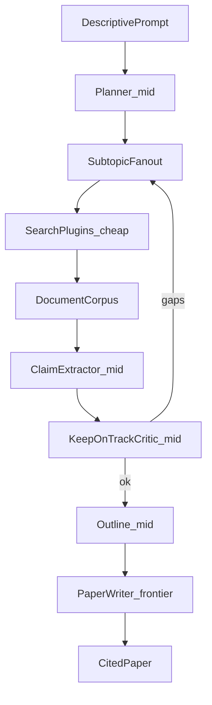
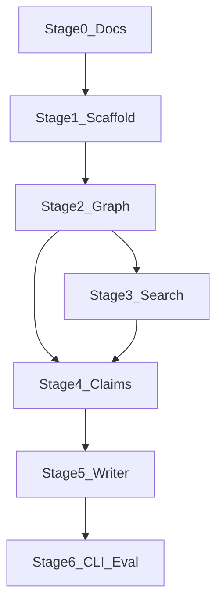

# DeepRhetor — Project Plan

> Source of truth for architecture and build stages.  
> Implementation has not started; this document is Stage 0.

## Vision

Given a descriptive prompt, DeepRhetor runs a research-writing pipeline that:

1. Decomposes the prompt into subtopics
2. Searches configurable document sources in parallel
3. Uses cheap models to keep only useful documents
4. Uses mid-tier models to extract structured, cited claims
5. Critiques coverage and coherence so work stays on track
6. Uses a frontier model to write the paper from claims only

The system optimizes for **grounded output** and **cost control**: expensive tokens are spent where prose quality matters; retrieval and filtering stay cheap.

## Locked decisions

| Area | Decision |
|------|----------|
| Runtime | Python + LangChain / LangGraph |
| Search | Pluggable BYO providers via a plugin interface |
| Model strategy | Cheap retrieve/filter → mid cited claims → frontier paper |
| Citations | Every claim carries source identity; writer may not invent unsupported facts |
| Vendor lock-in | No single search or LLM vendor at the core |

## Architecture



### Core modules (conceptual)

1. **Planner / supervisor** — Decompose the prompt into subtopics; fan out with LangGraph `Send()`.
2. **Search plugin interface** — `SearchProvider.search(query) -> list[DocumentRef]`; optional `fetch(url) -> Document`.
3. **Retrieval lane (cheap)** — Rank/filter hits, drop junk, keep useful passages.
4. **Claim lane (mid)** — Structured cited claims: `claim`, `source_id`, `quote`/`span`, `confidence`.
5. **Track-keeper (mid)** — Coverage vs outline, contradiction flags, re-search for gaps.
6. **Writer lane (frontier)** — Draft the paper only from the claim inventory + citations.

### Graph state (high-level)

Expected shared state for later LangGraph work:

- `prompt` — original user prompt
- `outline` / `subtopics` — planned structure
- `documents` — retrieved/filtered corpus
- `claims` — list of cited claims
- `gaps` / `critic_notes` — track-keeper output
- `paper` — final markdown (or similar) with bibliography

## Search plugins

Search is a **plugin surface**, not a built-in dependency on one API. A thin protocol + registry loads enabled providers from config. At least one configured provider is required to run a pipeline.

### Interface (target shape)

```python
# Illustrative — not implemented yet
class SearchProvider(Protocol):
    name: str
    def search(self, query: str, *, limit: int = 10) -> list[DocumentRef]: ...
    def fetch(self, ref: DocumentRef) -> Document | None: ...  # optional
```

Registry + config turn providers on/off and supply BYO API keys. The graph calls the registry, not a vendor SDK.

### Candidate first-party adapters

| Provider | Strength | Cost notes |
|----------|----------|------------|
| Tavily / Brave / SerpAPI | General web | Paid APIs; good for current events |
| DuckDuckGo HTML/API | Cheap web | Fragile / rate-limited; OK for early stubs |
| Wikipedia | Encyclopedia grounding | Free; shallow |
| arXiv / Semantic Scholar / Crossref | Academic literature | Strong for research papers |
| Local / user files | Upload or filesystem corpus | Offline / private docs |
| MCP bridge (later) | Reuse external tool servers | Optional interoperability |

### MVP plugin policy

- Ship interface + registry + config for enabled providers
- Ship stubs for 2–3 adapters in an early code stage
- Require ≥1 configured provider to run
- Do not hard-code a single search vendor as the system core

## Model tiers

| Lane | Role | Example defaults (configurable) |
|------|------|----------------------------------|
| Cheap | Light query rewrite, doc triage, relevance scrap | `gpt-4.1-mini` / Claude Haiku / Gemini Flash-class |
| Mid | Subtopic planning, claim extraction, track-keeping | Sonnet / GPT mid-tier |
| Frontier | Final paper prose | Opus / GPT-5-class / strongest available |

Models are provider-agnostic via LangChain chat model factories and env/config (OpenAI, Anthropic, Google, etc.). Lane assignment is config, not hard-coded model IDs in agent logic.

## Build stages

| Stage | Outcome | Status |
|-------|---------|--------|
| 0 | Docs + GitHub repo + submodule wiring | **Complete** |
| 1 | Python package scaffold, config, search plugin protocol | Pending |
| 2 | LangGraph skeleton: planner → search → claims → critic loop | Pending |
| 3 | One real search adapter + cheap triage | Pending |
| 4 | Mid-tier claim extraction + citation schema | Pending |
| 5 | Frontier writer + bibliography | Pending |
| 6 | CLI, eval harness, cost tracking | Pending |

### Dependency graph



## Open questions

- Default citation style (numeric vs author-year) and export formats (Markdown first vs PDF later)
- Whether outline approval is automated only or includes a human-in-the-loop interrupt
- Persistence: in-memory for MVP vs checkpointer (SQLite / Postgres) for resumable runs
- Budget caps per lane (max docs, max claim iterations, max critic loops)

## Out of scope for Stage 0

- LangChain / LangGraph code
- Dependencies, Docker, CI
- Implementing search adapters
