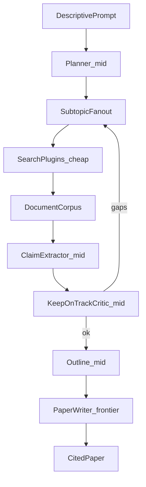

# DeepRhetor

DeepRhetor turns a descriptive research prompt into a **citation-backed paper**. It plans subtopics, searches pluggable document sources, extracts grounded claims, keeps the research on track, and writes the final prose with a cost-aware model ladder.

**Status: design only — not implemented yet.** See [PLAN.md](PLAN.md) for architecture and build stages.

## Cost ladder

| Lane | Job | Model tier |
|------|-----|------------|
| Retrieve | Search, triage, and filter documents | Cheap |
| Claim | Translate useful docs into lists of cited claims | Mid |
| Write | Compose the actual paper from the claim inventory | Frontier |

## Pipeline sketch

## Planned stack

- **Python** with **LangChain** / **LangGraph** for orchestration
- **Pluggable search providers** — bring your own APIs (web, academic, local files); no hard-coded single vendor at the core
- **Provider-agnostic chat models** for cheap / mid / frontier lanes

## License

MIT
